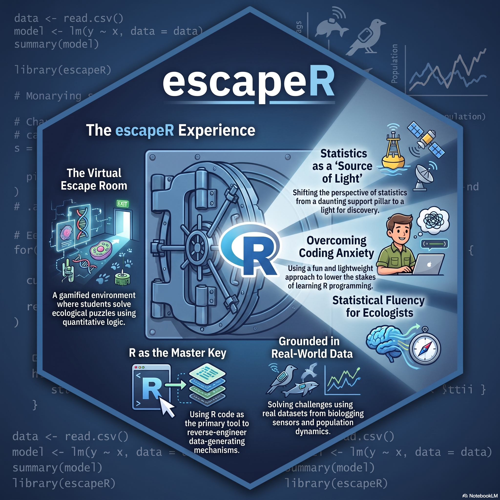
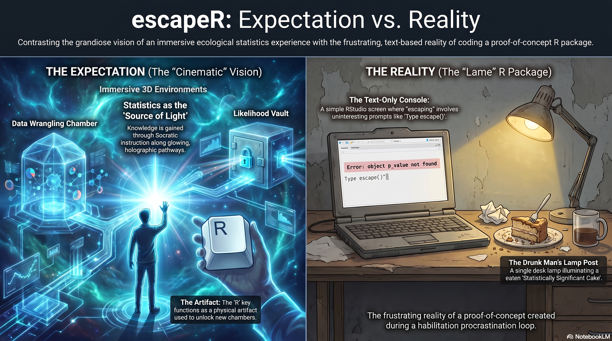

# escapeR

You are locked inside an Ecological Statistics escape room.

The doors open with R.

`escapeR` is a classroom game where you learn and practise R by solving small
ecological-statistics puzzles. Each room gives you a short story, a task, and a
lock. You use ordinary R commands to inspect data, make plots, fit models, and
think through ecological evidence. When you have the answer, submit it and move
to the next room.



The above image represents a vision. The more accurate vision vs reality meme is
at the bottom of this README file.

## Enter the Room

Install the package from GitHub:

```r
install.packages("remotes")
remotes::install_github("TiagoAMarques/escapeR")
```

Then begin:

```r
library(escapeR)
escape()
```

`escape()` asks for your player name and starts the quest. If you come back
later with the same name, your saved progress is loaded automatically.

## How to Play

Read the room. Solve the task in R. Submit the answer.

```r
submit(42)
```

If you need to see the current room again:

```r
play()
```

If you need a nudge:

```r
hint()
```

Some rooms have several hints. Repeated calls reveal them one at a time.

To check where you are:

```r
status()
```

To start over:

```r
reset_game()
```

## The Quest

The current escape has 20 rooms across seven parts of an introductory
Ecological Statistics journey:

1. R foundations: arithmetic, vectors, and named objects.
2. Data import and inspection: built-in data, CSV files, columns, and missing values.
3. Visualisation: detection patterns, categorical summaries, and hidden structure in data.
4. Data manipulation: subsetting and ordering data frames.
5. Ecological modelling: linear models, residuals, and prediction.
6. Distance sampling: observation processes, detections, and truncation.
7. Reproducible workflow: comments, web data, GLMs, and Quarto source files.

To see every room:

```r
list_rooms()
```

For a fuller walkthrough:

```r
vignette("getting-started-with-escapeR", package = "escapeR")
```

## Useful Data

Some rooms use data bundled with the package:

```r
survey_counts()
escapeR_file("dados1.csv")
escapeR_file("datahide.txt")
```

The game expects you to work with these just like normal R data: read them,
inspect them, plot them, model them, and check your assumptions.

## For Instructors

You can build shorter quests from selected rooms:

```r
river_escape <- build_escape(c("console", "vector", "plotwin"))
escape(player = "student1", reset = TRUE, escape = river_escape)
```

You can also create and register your own rooms:

```r
parasite_room <- new_room(
  id = "paras",
  module = "R foundations",
  title = "The Parasite Count",
  learning_goal = "Create vectors and summarize them.",
  introduction = "A sample tray holds river fish records.",
  challenge = "Submit the mean parasite count.",
  hints = c("Store the counts in a vector first.", "mean() calculates the average."),
  correct_result = 15,
  success = "The tray label clicks into place."
)

register_rooms(parasite_room)
build_escape(c("console", "paras"))
```

To learn how to create themed rooms and room packs:

```r
vignette("creating-themed-escape-rooms", package = "escapeR")
```

## Project Notes

`escapeR` started as a playful way to teach R in an Ecological Statistics
context. It is inspired by introductory R teaching material, ecological
modelling, and distance-sampling ideas.

Wrong answers return encouraging messages that point students back to useful
habits: checking object names, inspecting data structure, iterating carefully,
and treating models as tools for thinking rather than magic doors.

Future directions may include more rooms, Portuguese and English text modes,
instructor-authored room packs, Shiny or learnr front ends, classroom
leaderboards, and export of student progress.


